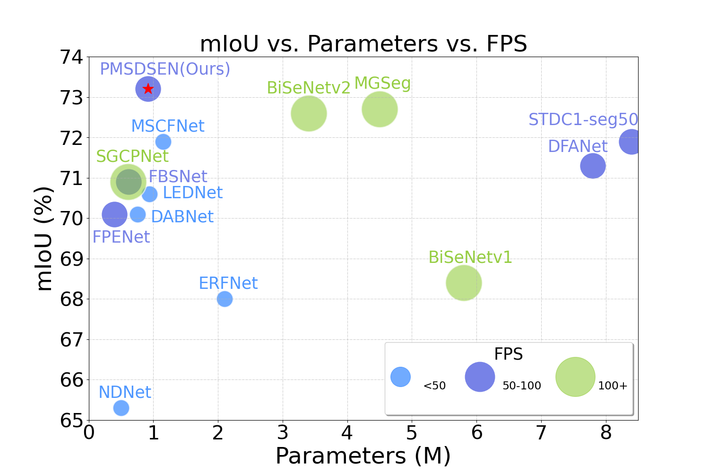
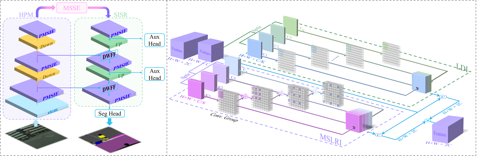
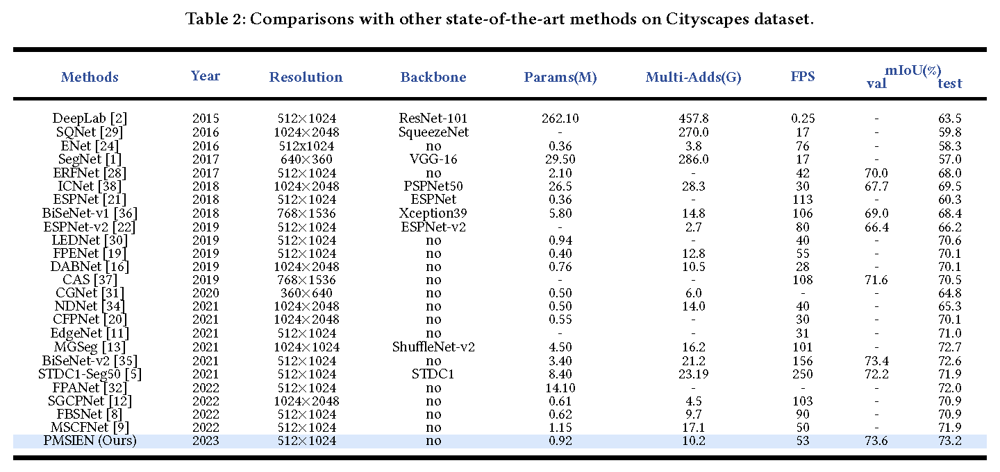
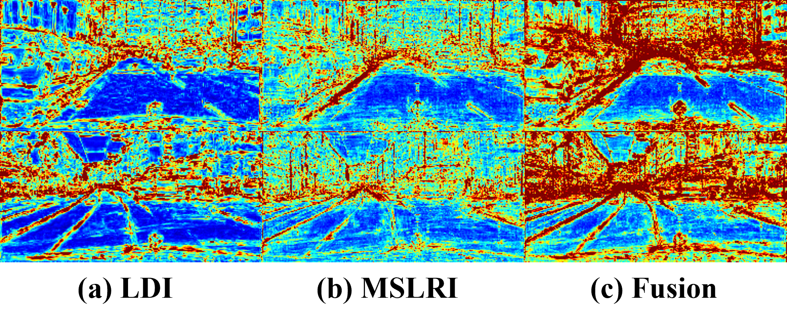

# [ACM MM-2023] Efficient Parallel Multi-Scale Detail and Semantic Encoding Network for Lightweight Semantic Segmentation
Xiao Liu<sup>1 </sup>, Xiuya Shi<sup>1 </sup>, Lufei Chen<sup>1 </sup>, [Linbo Qing](https://scholar.google.com.hk/citations?hl=zh-CN&user=0KRDflwAAAAJ)<sup>1 </sup> and [Chao Ren](https://scholar.google.com.hk/citations?hl=zh-CN&user=Y6OuBMYAAAAJ)<sup>1, *</sup>

<sup>1</sup> Sichuan University,   <sup> *</sup> Corresponding Author

🤗 [paper](https://dl.acm.org/doi/abs/10.1145/3581783.3611848) 😀 [Supplementary materials](https://github.com/liux520/PMSDSEN/blob/main/Docs/supplementary%20material.pdf)



<hr />

## :writing_hand: Changelog and ToDos
- [x] Test Set Results submitted to the [Cityscapes website]().  [Val: 75.02 | Test: 73.99]
- [x] (2023/11/6) Release training and evaluation code along with pre-trained models.
<hr />

## :bulb: Abstract


> **Abstract:** In this work, we propose PMSDSEN, a parallel multi-scale encoderdecoder network architecture for semantic segmentation, inspired
> by the human visual perception system’s ability to aggregate contextual information in various contexts and scales. Our approach introduces the efficient Parallel Multi-Scale Detail and Semantic Encoding (PMSDSE) unit to extract detailed local information and coarse large-range relationships in parallel, enabling the recognition of object boundaries and object-level areas. By stacking multiple PMSDSEs, our method learns fine-grained details and textures along with abstract category and semantic information, effectively utilizing a larger range of surrounding context information for robust segmentation. To further enhance the network’s receptive field without increasing computational complexity, the Multi-Scale Semantic Extractor (MSSE) at the end of the encoder is utilized for multi-scale semantic context extraction and detailed information encoding. Additionally, the Dynamic Weighted Feature Fusion (DWFF) strategy is employed to integrate shallow layer detail information and deep layer semantic information during the decoder stage. Our method can obtain multi-scale context from local to global, achieving efficiently low-level feature extraction to high level semantic interpretation at different scales and in different contexts. Without bells and whistles, PMSDSEN obtains a better trade-off between accuracy and complexity on popular benchmarks, including Cityscapes and Camvid. Specifically, PMSDSEN attains 73.2% mIoU with only 0.9M parameters on the Cityscapes test set.
<hr />

## :sparkles: Segmentation Results
<details>
	<summary><strong>Quantitative Comparison with SOTA</strong> (click to expand) </summary>
    <p></p>
	Quantitative comparison with SOTA on Cityscapes dataset.
</details>
<details>
	<summary><strong>Qualitative Comparison with SOTA</strong> (click to expand) </summary>
    <p></p>
    <p></p>
    <p></p>
    <p></p>
</details>
<details>
	<summary><strong>Feature visualization analysis</strong> (click to expand) </summary>
	<p></p>
    <p></p>
	Visualization of features for each branch in the PMSDSEN. PMSDSEN can extract rich and detailed local information, as well as coarse and complex large-range relationships parallelly. Therefore, the fusion features possess finely detailed localization and powerful long-range relationships. Visualization of features for various fusion strategies. DWFF enables network to focus on the most informative parts of feature map by comparing the darker parts of the feature map.
</details>
<hr />

## :rocket: Installation

This repository is built in PyTorch 1.12.1 and trained on Centos 4.18.0 environment (Python3.7, CUDA11.6, cuDNN8.0). 

1. Clone our repository
```
git clone https://github.com/liux520/PMSDSEN.git
cd PMSDSEN
```
<hr />

## :computer: Usage

### 0. Dataset Preparation

- Download datasets [Cityscapes](https://www.cityscapes-dataset.com/downloads/) and [CamVid](https://www.kaggle.com/datasets/carlolepelaars/camvid).

- It is recommended to symlink the dataset root to `Datasets` with the follow command:

  For Linux: `ln -s [Your Dataset Path] [PMSDSEN Project Path/Datasets]` 

  For Windows: `mklink /d [PMSDSEN Project Path\Datasets] [Your Dataset Path]`   (In administrator mode)

- The file structure is as follows:

  ```
  Data
  Datasets
  ├─CamVid   
  │  ├─test
  │  ├─testannot
  │  ├─train
  |  ├─trainannot
  |  ├─val
  │  └─valannot
  ├─Cityscapes
  │  ├─gtCoarse
  │  ├─gtFine
  │  └─leftImg8bit  
  Demo
  ...
  ```

### 1. Evaluation
Download the pretrained weights and run the following command for evaluation on widely-used Benchmark datasets.
```
python Demo/eval.py 
```
If you just want to generate an image, you can run demo.py.
```
python Demo/demo.py 
```

### 2. Training

- Stage1: Training the model **PMSDSEN**.

```
CUDA_VISIBLE_DEVICES=0 python Trainer_seg.py --wandb_project Default --use_cuda --gpu_ids 0 --exp_name PMSDSEN_stage1 --train_batchsize 12 --val_batchsize 4 --crop_size 512 256 --workers 4 --dataset cityscapes --use_balanced_weights --loss_type ce --lr 0.045 --lr_scheduler poly --warmup_epochs 0 --start_epoch 0 --epochs 500 --model PMSDSEN --optimizer SGD --momentum 0.9 --weight_decay 1e-4
```

- Stage 2: Training the model **PMSDSEN**.

```
CUDA_VISIBLE_DEVICES=0 python Trainer_seg.py --wandb_project Default --use_cuda --gpu_ids 0 --exp_name PMSDSEN_stage2 --train_batchsize 6 --val_batchsize 4 --crop_size 1024 512  --workers 4 --dataset cityscapes --use_balanced_weights --loss_type ce --lr 0.01 --lr_scheduler poly --warmup_epochs 0 --start_epoch 0 --epochs 500 --model PMSDSEN --optimizer SGD --momentum 0.9 --weight_decay 1e-4 --resume [pretrained stage1 model] --finetune --freeze_bn
```

- Tips on the training or finetuning.

```
For Cityscapes dataset, we adopt a two-stage training strategy. In the first stage, a smaller image resolution (512 × 256) is used as input to fit a larger batch-size and faster convergence speed. We train model for 500 epochs using SGD with an initial learning rate of 4.5×10−2. In the second stage, we freeze the batch normalization layers and finetune the model at a slightly higher image resolution (1024 × 512). We train the second stage model for 500 epochs using SGD with initial learning rate of 1 × 10−2. For Camvid dataset, we use only one-stage training strategy and train the model for 1000 epochs.
```
<hr />

## :e-mail: Contact
Should you have any question, please create an issue on this repository or contact at liuxmail1220@gmail.com & shixiuya@stu.scu.edu.cn &chenlufei@stu.scu.edu.cn.

<hr />

## :heart: Acknowledgement
Thanks to the lucky aura of the second author!

We are thankful for these excellent works: [[STDC]](https://github.com/MichaelFan01/STDC-Seg) [[PyTorch-Enconding]]([zhanghang1989/PyTorch-Encoding: A CV toolkit for my papers. (github.com)](https://github.com/zhanghang1989/PyTorch-Encoding))[[EdgeNets]([sacmehta/EdgeNets: This repository contains the source code of our work on designing efficient CNNs for computer vision (github.com)](https://github.com/sacmehta/EdgeNets))] !

<hr />

## :pray: Citation
If this work is helpful for you, please consider citing:

```
@inproceedings{PMSDSEN,
author = {Liu, Xiao and Shi, Xiuya and Chen, Lufei and Qing, Linbo and Ren, Chao},
title = {Efficient Parallel Multi-Scale Detail and Semantic Encoding Network for Lightweight Semantic Segmentation},
year = {2023},
isbn = {9798400701085},
publisher = {Association for Computing Machinery},
address = {New York, NY, USA},
url = {https://doi.org/10.1145/3581783.3611848},
doi = {10.1145/3581783.3611848},
booktitle = {Proceedings of the 31st ACM International Conference on Multimedia},
pages = {2544–2552},
numpages = {9},
keywords = {lightweight semantic segmentation, parallel multi-scale information encoding},
location = {Ottawa ON, Canada},
series = {MM '23}
}
```